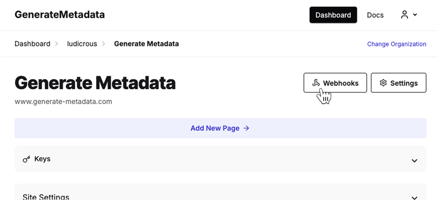
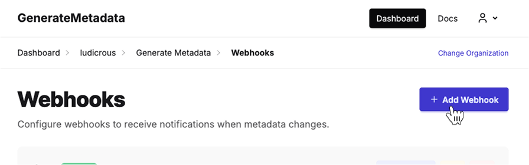
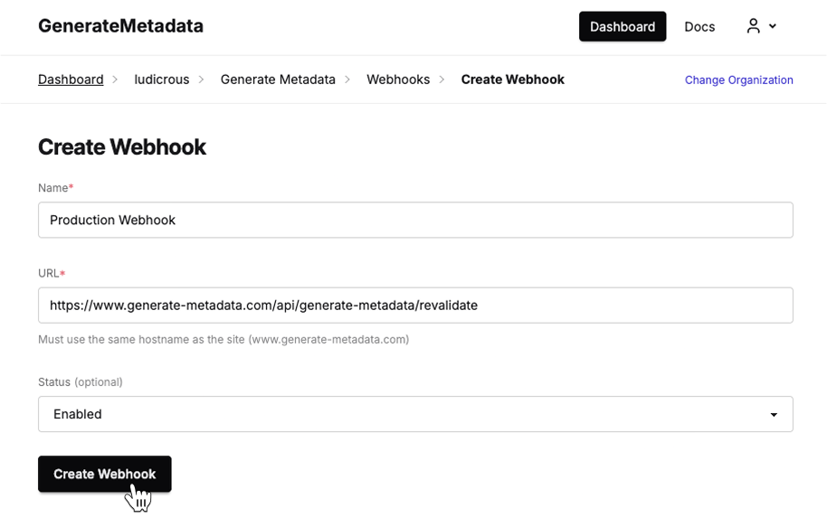

## Prerequisites

- Next.js 13+ with App Router
- generate-metadata installed (`npm install generate-metadata`)
- DSN from [generate-metadata.com](https://generate-metadata.com)
- API key for authentication (required for Next.js adapter)

## Environment Configuration

### 1. Add Environment Variables

Create or update your `.env.local` file:

```bash title=".env.local"
NEXT_PUBLIC_GENERATE_METADATA_DSN=your_dsn_here
GENERATE_METADATA_API_KEY=your_api_key_here
GENERATE_METADATA_WEBHOOK_SECRET=your_webhook_secret_here
```

### 2. Create Metadata Client

Create a shared client instance.

```ts title="lib/metadata.ts"
import { GenerateMetadataClient } from "generate-metadata/next";

export const metadataClient = new GenerateMetadataClient({
  dsn: process.env.NEXT_PUBLIC_GENERATE_METADATA_DSN,
  apiKey: process.env.GENERATE_METADATA_API_KEY,
});
```

## Setup Pages

### Root Layout

The root layout metadata is used to populate default metadata/fallbacks for all pages.

```tsx title="app/layout.tsx"
import { metadataClient } from "@/lib/metadata";

export const generateMetadata = metadataClient.getRootMetadata();

export default function RootLayout({
  children,
}: {
  children: React.ReactNode;
}) {
  return (
    <html lang="en">
      <body>{children}</body>
    </html>
  );
}
```

### Static Pages

To install on a page with a static path, simply provide the `path` option.

```tsx title="app/page.tsx"
import { metadataClient } from "@/lib/metadata";

export const generateMetadata = metadataClient.getMetadata(() => ({
  path: "/",
}));

export default function HomePage() {
  return (
    <div>
      <h1>Welcome to My App</h1>
      <p>This page will have AI-optimized metadata!</p>
    </div>
  );
}
```

### Dynamic Pages

For dynamic page paths, you will need to construct the path using route parameters.

```tsx title="app/blog/[slug]/page.tsx"
import { metadataClient } from "@/lib/metadata";

interface PageProps {
  params: Promise<{ slug: string }>;
}

export const generateMetadata = metadataClient.getMetadata(
  async (props: PageProps) => {
    const params = await props.params;
    return {
      path: `/blog/${params.slug}`,
    };
  }
);

export default async function BlogPost(props: PageProps) {
  const params = await props.params;
  return (
    <article>
      <h1>Blog Post: {params.slug}</h1>
      <p>Content goes here...</p>
    </article>
  );
}
```

## Build and Deploy

That's it! 🎉

The next time you build and deploy your Next.js application, the Generate Metadata dashboard will automatically be populated with all of the pages you have set up. You may manually fill in the metadata or let the AI generate it for you.

If you make changes to your content, you will need to redeploy your site. For instant updates, you can set up the Automatic Revalidation step below.

## Automatic Revalidation (optional)

The revalidation handler will automatically refresh the metadata cache when your content changes through Next.js's built in [Revalidation](https://nextjs.org/docs/app/getting-started/caching-and-revalidating) API.

<Callout type="warn">
  This will not work for [Static
  Export](https://nextjs.org/docs/app/guides/static-exports) Next.js
  deployments.
</Callout>

### Webhook Handler

Create the webhook API route handler:

```ts title="app/api/generate-metadata/revalidate/route.ts"
import { metadataClient } from "@/lib/metadata";

export const { DELETE, GET, HEAD, OPTIONS, PATCH, POST, PUT } =
  metadataClient.revalidateWebhookHandler({
    webhookSecret: process.env.GENERATE_METADATA_WEBHOOK_SECRET,
  });
```

<Callout type="info">
  Keep your webhook secret secure. Never expose it in client-side code or public
  repositories.
</Callout>

Once you have the handler set up, go ahead and deploy it. Once deployed you can move onto configuring the webhook

### Set Up the Webhook

The last step is telling Generate Metadata where to send webhook events to.

First in the dashboard for your site, head over to the Webhooks page.



Then click "Add Webhook" to create a new webhook.



Give the webhook a name such as "Production Webhook". If you named placed the route handler in `app/api/generate-metadata/revalidate/route.ts` and your site name matches, you can leave the URL as the default setting.



Click save and you're done!

### Verify the Webhook

To verify that your webhook has been set up correctly, change the metadata for a page in the dashboard and save it. You should see the new metadata immediately reflected on your site. You can also see more details about requests made to your webhook in the Webhook details page.
