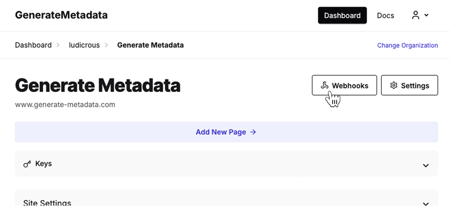
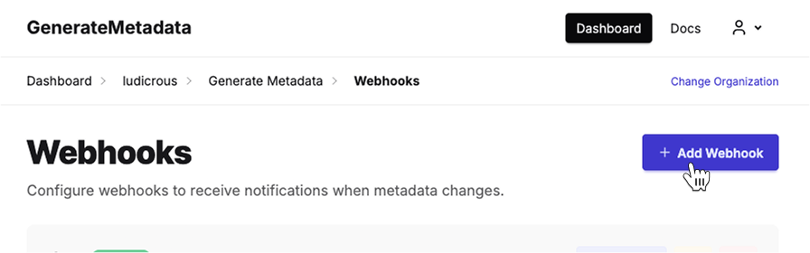
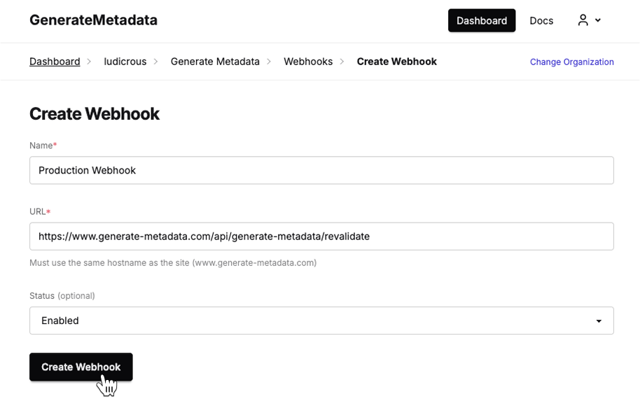

## Prerequisites

- TanStack Start 1.0+
- generate-metadata installed (`npm install generate-metadata`)
- DSN from [generate-metadata.com](https://generate-metadata.com)
- API key for authentication (optional but recommended)

## Environment Configuration

### 1. Add Environment Variables

Create or update your `.env.local` file:

```bash title=".env.local"
VITE_GENERATE_METADATA_DSN=your_dsn_here
GENERATE_METADATA_API_KEY=your_api_key_here
GENERATE_METADATA_WEBHOOK_SECRET=your_webhook_secret_here
```

### 2. Create Metadata Client

Create a shared client instance.

```ts title="lib/metadata.ts"
import { GenerateMetadataClient } from "generate-metadata/tanstack-start";
import { createServerFn } from "@tanstack/react-start";

const serverFn = createServerFn()
  .validator(GenerateMetadataClient.serverFnValidator)
  .handler((ctx) =>
    GenerateMetadataClient.serverFnHandler(ctx, {
      apiKey: serverEnv.GENERATE_METADATA_API_KEY,
    }),
  );

export const metadataClient = new GenerateMetadataClient({
  serverFn,
  dsn: clientEnv.VITE_GENERATE_METADATA_DSN,
});
```

<Callout type="info">
  The `serverFn` is optional but recommended in order to enable certain features
  such as automatic page creation in the dashboard.
</Callout>

## Setup Pages

### Root Layout

The root layout metadata is used to populate default metadata/fallbacks for all pages.

```tsx title="app/layout.tsx"
TODO;
```

### Static Pages

To install on a page with a static path, simply provide the `path` option.

```tsx title="routes/index.tsx"
import { createFileRoute } from "@tanstack/react-router";
import { metadataClient } from "@/lib/generate-metadata";

export const Route = createFileRoute("/")({
  component: RouteComponent,
  head: (ctx) => metadataClient.getHead({ ctx }), // If you do not pass `path` to `getHead`, the path will be inferred from the route context
});

function RouteComponent() {
  return (
    <div>
      <h1>Welcome to My App</h1>
      <p>This page will have AI-optimized metadata!</p>
    </div>
  );
}
```

### Dynamic Pages

For dynamic page paths, you will need to construct the path using route parameters.

```tsx title="routes/posts/$postId/index.tsx"
import { createFileRoute } from "@tanstack/react-router";
import { metadataClient } from "@/lib/generate-metadata";

export const Route = createFileRoute("/posts/$postId/")({
  component: RouteComponent,
  head: (ctx) => metadataClient.getHead({ ctx }), // If you do not pass `path` to `getHead`, the path will be inferred from the route context
});

function RouteComponent() {
  const { postId } = Route.useParams();
  return <div>Hello {postId}!</div>;
}
```

## Build and Deploy

That's it! 🎉

The next time you build and deploy your Tanstack Start application, the Generate Metadata dashboard will automatically be populated with all of the pages you have set up. You may manually fill in the metadata or let the AI generate it for you.

If you make changes to your content, you will need to redeploy your site. For instant updates, you can set up the Automatic Revalidation step below.

## Automatic Revalidation (optional)

The revalidation handler will automatically refresh the metadata cache when your content changes through a webhook.

<Callout type="warn">
  This will not work in [SPA
  mode](https://tanstack.com/start/latest/docs/framework/react/spa-mode).
</Callout>

### Webhook Handler

Create the webhook server route:

```ts title="routes/api/generate-metadata/revalidate.ts"
import { createServerFileRoute } from "@tanstack/react-start/server";
import { metadataClient } from "@/lib/generate-metadata";

const methods = metadataClient.revalidateWebhookHandler({
  webhookSecret: process.env.GENERATE_METADATA_WEBHOOK_SECRET,
});
export const ServerRoute = createServerFileRoute(
  "/api/generate-metadata/revalidate",
).methods(methods);
```

<Callout type="info">
  Keep your webhook secret secure. Never expose it in client-side code or public
  repositories.
</Callout>

Once you have the handler set up, go ahead and deploy it. Once deployed you can move onto configuring the webhook

### Set Up the Webhook

The last step is telling Generate Metadata where to send webhook events to.

First in the dashboard for your site, head over to the Webhooks page.



Then click "Add Webhook" to create a new webhook.



Give the webhook a name such as "Production Webhook". If you named placed the route handler in `routes/api/generate-metadata/revalidate.ts` and your site name matches, you can leave the URL as the default setting.



Click save and you're done!

### Verify the Webhook

To verify that your webhook has been set up correctly, change the metadata for a page in the dashboard and save it. You should see the new metadata immediately reflected on your site. You can also see more details about requests made to your webhook in the Webhook details page.
